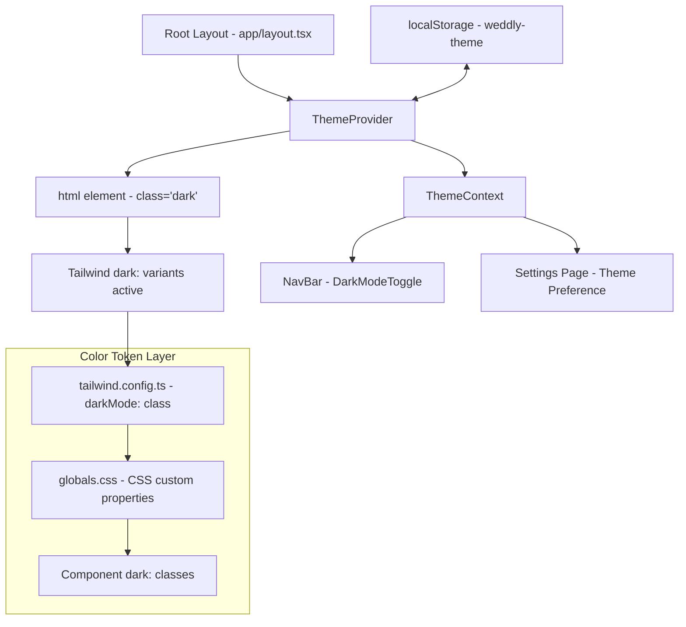
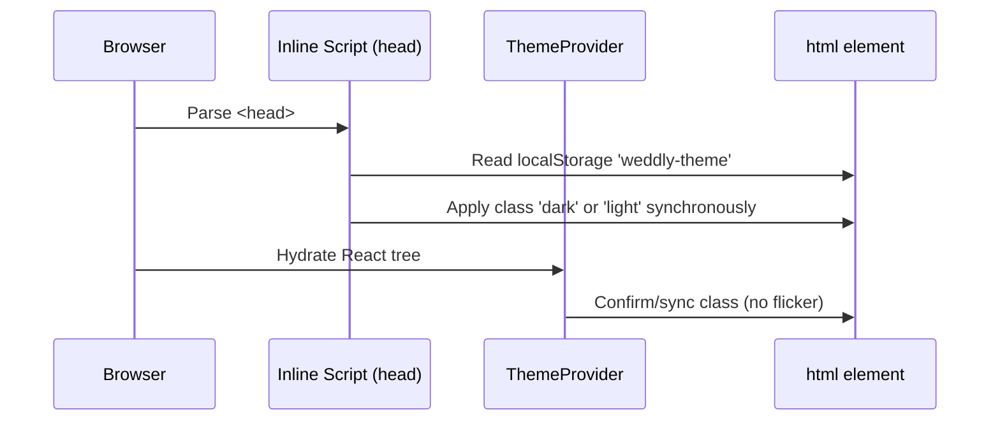
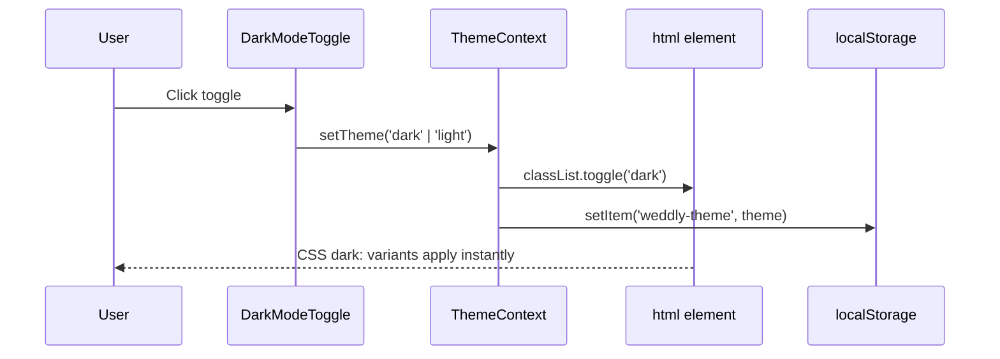
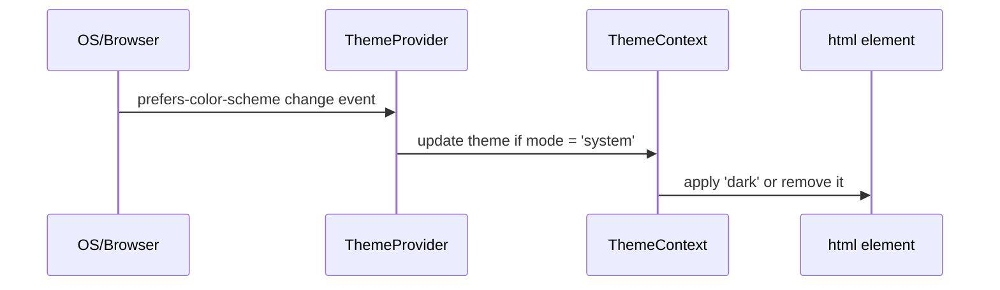

# Design Document: Dark Mode

## Overview

Dark mode adds a user-selectable light/dark color scheme to the Weddly app. The implementation uses Tailwind CSS's built-in `darkMode: 'class'` strategy, a React context for theme state, `localStorage` for persistence, and `next-themes` (or a lightweight custom provider) to avoid flash-of-unstyled-content (FOUC) on page load. All four app sections — client, freelancer, admin, and venue — share the same theme mechanism through the root layout.

The existing Weddly design system already defines a rich Material Design 3-inspired color palette (primary greens, secondary golds, surface tokens). Dark mode maps each light-mode surface/text token to a corresponding dark-mode counterpart, preserving brand identity while reducing eye strain in low-light environments.

The feature is intentionally additive: no existing component logic changes, only CSS class additions and a new theme provider layer.

---

## Architecture



---

## Sequence Diagrams

### Initial Page Load (FOUC Prevention)



### User Toggles Theme



### System Preference Sync



---

## Components and Interfaces

### Component 1: ThemeProvider

**Purpose**: Wraps the entire app, reads persisted preference, applies the `dark` class to `<html>`, and exposes theme state via context.

**Interface**:
```typescript
interface ThemeProviderProps {
  children: React.ReactNode
  defaultTheme?: 'light' | 'dark' | 'system'
  storageKey?: string          // default: 'weddly-theme'
}

interface ThemeContextValue {
  theme: 'light' | 'dark' | 'system'
  resolvedTheme: 'light' | 'dark'   // 'system' resolved to actual value
  setTheme: (theme: 'light' | 'dark' | 'system') => void
  toggleTheme: () => void
}
```

**Responsibilities**:
- Read `localStorage` on mount and apply class before first paint (via inline script in `<head>`)
- Listen to `prefers-color-scheme` media query when theme is `'system'`
- Persist theme choice to `localStorage`
- Provide `ThemeContext` to all descendants

---

### Component 2: DarkModeToggle

**Purpose**: Replaces the existing question mark (`?`) icon in the navbar's right section. Clicking it toggles between light and dark mode. No new icon is added — the existing `QuestionMarkCircleIcon` slot is repurposed.

**Interface**:
```typescript
interface DarkModeToggleProps {
  className?: string
}
```

**Responsibilities**:
- Consume `ThemeContext` and call `toggleTheme()`
- Render in place of the existing question mark icon in the navbar
- Show a sun icon when dark mode is active, moon icon when light mode is active
- Be accessible: `aria-label`, `aria-pressed`, keyboard-operable

---

### Component 3: ThemeScript (FOUC Prevention)

**Purpose**: A tiny inline `<script>` injected into `<head>` before any CSS loads. Reads `localStorage` and sets the `dark` class synchronously so there is no flash.

**Interface**:
```typescript
// No props — renders a <script> tag with dangerouslySetInnerHTML
function ThemeScript(): JSX.Element
```

**Responsibilities**:
- Execute synchronously during HTML parse (before React hydration)
- Apply `dark` class to `<html>` if stored preference or system preference is dark
- Must be a Server Component (no `"use client"`) to render in `<head>`

---

## Data Models

### ThemePreference

```typescript
type ThemeMode = 'light' | 'dark' | 'system'

interface ThemePreference {
  mode: ThemeMode
  // Stored in localStorage under key 'weddly-theme'
  // Value is the ThemeMode string
}
```

**Validation Rules**:
- Value must be one of `'light'`, `'dark'`, `'system'`
- Invalid/missing values fall back to `'system'`

---

### Dark Color Token Map

The existing Tailwind config defines light-mode surface tokens. Dark mode adds a parallel set via CSS custom properties:

```typescript
interface ColorTokenMap {
  // Light → Dark mapping
  background: '#fcf9f6' → '#0f1410'
  surface: '#fcf9f6' → '#1a1f1c'
  'surface-container': '#f0edea' → '#1f2520'
  'surface-container-high': '#eae8e5' → '#252b27'
  'surface-container-highest': '#e5e2df' → '#2c332e'
  'on-surface': '#1b1c1a' → '#e3e3e0'
  'on-surface-variant': '#414944' → '#c1c9c2'
  'outline-variant': '#c0c9c2' → '#3a4240'
  'inverse-surface': '#31302f' → '#e5e2df'
  'inverse-on-surface': '#f3f0ed' → '#31302f'
  // Primary/secondary brand colors remain the same — they work on both backgrounds
}
```

---

## Algorithmic Pseudocode

### Theme Initialization Algorithm

```pascal
ALGORITHM initializeTheme()
INPUT: none (reads localStorage and window.matchMedia)
OUTPUT: resolvedTheme of type 'light' | 'dark'

BEGIN
  storedTheme ← localStorage.getItem('weddly-theme')
  
  IF storedTheme IS NOT NULL AND storedTheme IN ['light', 'dark', 'system'] THEN
    mode ← storedTheme
  ELSE
    mode ← 'system'
  END IF
  
  IF mode = 'system' THEN
    prefersDark ← window.matchMedia('(prefers-color-scheme: dark)').matches
    IF prefersDark THEN
      resolvedTheme ← 'dark'
    ELSE
      resolvedTheme ← 'light'
    END IF
  ELSE
    resolvedTheme ← mode
  END IF
  
  IF resolvedTheme = 'dark' THEN
    document.documentElement.classList.add('dark')
  ELSE
    document.documentElement.classList.remove('dark')
  END IF
  
  RETURN resolvedTheme
END
```

**Preconditions**:
- `localStorage` is accessible (browser environment)
- `window.matchMedia` is available

**Postconditions**:
- `<html>` element has class `'dark'` if and only if `resolvedTheme = 'dark'`
- Returns the concrete resolved theme

**Loop Invariants**: N/A

---

### setTheme Algorithm

```pascal
ALGORITHM setTheme(newMode)
INPUT: newMode of type 'light' | 'dark' | 'system'
OUTPUT: none (side effects: DOM class, localStorage, React state)

BEGIN
  ASSERT newMode IN ['light', 'dark', 'system']
  
  localStorage.setItem('weddly-theme', newMode)
  
  IF newMode = 'system' THEN
    prefersDark ← window.matchMedia('(prefers-color-scheme: dark)').matches
    IF prefersDark THEN
      resolved ← 'dark'
    ELSE
      resolved ← 'light'
    END IF
  ELSE
    resolved ← newMode
  END IF
  
  IF resolved = 'dark' THEN
    document.documentElement.classList.add('dark')
  ELSE
    document.documentElement.classList.remove('dark')
  END IF
  
  setState({ theme: newMode, resolvedTheme: resolved })
END
```

**Preconditions**:
- `newMode` is a valid `ThemeMode` value

**Postconditions**:
- `localStorage['weddly-theme']` equals `newMode`
- `document.documentElement.classList` contains `'dark'` iff resolved is dark
- React state reflects the new theme

---

### toggleTheme Algorithm

```pascal
ALGORITHM toggleTheme()
INPUT: current resolvedTheme
OUTPUT: none

BEGIN
  IF resolvedTheme = 'dark' THEN
    setTheme('light')
  ELSE
    setTheme('dark')
  END IF
END
```

**Preconditions**:
- `resolvedTheme` is either `'light'` or `'dark'`

**Postconditions**:
- Theme is flipped from its current resolved value
- `'system'` mode is exited when user explicitly toggles

---

## Key Functions with Formal Specifications

### useTheme()

```typescript
function useTheme(): ThemeContextValue
```

**Preconditions**:
- Must be called inside a component wrapped by `ThemeProvider`

**Postconditions**:
- Returns `{ theme, resolvedTheme, setTheme, toggleTheme }`
- `resolvedTheme` is always `'light'` or `'dark'` (never `'system'`)
- Throws if called outside `ThemeProvider` context

---

### ThemeScript render

```typescript
function ThemeScript(): JSX.Element
// Returns: <script dangerouslySetInnerHTML={{ __html: inlineScript }} />
```

**Preconditions**:
- Must be rendered as a Server Component inside `<head>`

**Postconditions**:
- Script executes synchronously before CSS/JS bundles load
- No React hydration mismatch (script only touches DOM, not React state)

---

### applyDarkClass(resolved: 'light' | 'dark'): void

```typescript
function applyDarkClass(resolved: 'light' | 'dark'): void
```

**Preconditions**:
- `document` is available (client-side only)

**Postconditions**:
- `document.documentElement.classList.contains('dark')` === `(resolved === 'dark')`
- No other classes are added or removed

---

## Example Usage

```typescript
// 1. Root layout — wrap with ThemeProvider and inject ThemeScript
// app/layout.tsx
import { ThemeProvider } from '@/app/context/ThemeProvider'
import { ThemeScript } from '@/app/ui/ThemeScript'

export default function RootLayout({ children }) {
  return (
    <html lang="en" suppressHydrationWarning>
      <head>
        <ThemeScript />
      </head>
      <body>
        <ThemeProvider defaultTheme="system" storageKey="weddly-theme">
          {children}
        </ThemeProvider>
      </body>
    </html>
  )
}

// 2. DarkModeToggle — replaces the existing question mark icon in the navbar
// app/ui/navbar/DarkModeToggle.tsx
import { useTheme } from '@/app/context/ThemeProvider'
import { SunIcon, MoonIcon } from '@heroicons/react/24/outline'

export function DarkModeToggle({ className }: { className?: string }) {
  const { resolvedTheme, toggleTheme } = useTheme()
  return (
    <button
      onClick={toggleTheme}
      aria-label={resolvedTheme === 'dark' ? 'Switch to light mode' : 'Switch to dark mode'}
      aria-pressed={resolvedTheme === 'dark'}
      className={`inline-flex h-10 w-10 items-center justify-center rounded-full
                 hover:bg-surface-container transition-colors ${className ?? ''}`}
    >
      {resolvedTheme === 'dark'
        ? <SunIcon className="h-6 w-6" />
        : <MoonIcon className="h-6 w-6" />}
    </button>
  )
}
// In the navbar, replace the existing QuestionMarkCircleIcon button with <DarkModeToggle />

// 3. Component using dark: variants
// Any component — example card
<div className="bg-white dark:bg-surface-container rounded-xl p-4
                text-on-surface dark:text-on-surface">
  <h2 className="text-primary dark:text-primary-300">Wedding Gig</h2>
</div>

// 4. Tailwind config — enable class strategy
// tailwind.config.ts
const config: Config = {
  darkMode: 'class',   // ← add this line
  // ...rest unchanged
}
```

---

## Correctness Properties

*A property is a characteristic or behavior that should hold true across all valid executions of a system — essentially, a formal statement about what the system should do. Properties serve as the bridge between human-readable specifications and machine-verifiable correctness guarantees.*

### Property 1: Theme Persistence Round-Trip

*For any* valid ThemeMode value `p ∈ {'light', 'dark', 'system'}`, after calling `setTheme(p)`, `localStorage['weddly-theme']` must equal `p`.

**Validates: Requirements 1.1**

---

### Property 2: Page Load Restores Persisted Theme

*For any* stored preference in `localStorage['weddly-theme']`, on page load the ThemeProvider must restore that preference and apply the corresponding `dark` class state to `<html>` before the first paint.

**Validates: Requirements 1.2, 4.2**

---

### Property 3: resolvedTheme Is Always Concrete

*For any* ThemeMode value (including `'system'`), `resolvedTheme` must always be one of `{'light', 'dark'}` and never `'system'`.

**Validates: Requirements 2.1**

---

### Property 4: toggleTheme Is an Involution

*For any* starting `resolvedTheme`, calling `toggleTheme()` twice in succession must return `resolvedTheme` to its original value.

**Validates: Requirements 5.2, 5.3**

---

### Property 5: DOM Class Matches resolvedTheme

*For any* call to `applyDarkClass(resolved)`, `document.documentElement.classList.contains('dark')` must equal `(resolved === 'dark')`, and no other classes must be added or removed.

**Validates: Requirements 3.1, 3.2, 3.3**

---

### Property 6: System Preference Isolation

*For any* OS `prefers-color-scheme` change event, the ThemeProvider must update `resolvedTheme` if and only if the current `theme` is `'system'`; explicit `'light'` or `'dark'` preferences must not be overridden.

**Validates: Requirements 2.4, 2.5**

---

### Property 7: Invalid Storage Value Falls Back Safely

*For any* string value in `localStorage['weddly-theme']` that is not in `{'light', 'dark', 'system'}`, the ThemeProvider must fall back to `'system'` mode without throwing an error.

**Validates: Requirements 1.3, 10.2**

---

## Error Handling

### Scenario 1: localStorage Unavailable (SSR / Private Browsing)

**Condition**: `localStorage` access throws (SSR context or storage blocked)
**Response**: Catch the error, fall back to `'system'` preference resolved via `matchMedia`
**Recovery**: Theme still works for the session; preference is not persisted

### Scenario 2: Invalid Stored Value

**Condition**: `localStorage['weddly-theme']` contains an unexpected string
**Response**: Treat as `'system'` (default fallback)
**Recovery**: On next explicit toggle, a valid value is written

### Scenario 3: Hydration Mismatch

**Condition**: Server renders without `dark` class; client applies it before hydration
**Response**: `suppressHydrationWarning` on `<html>` suppresses React's warning for the class attribute
**Recovery**: No visual flicker because `ThemeScript` runs synchronously in `<head>`

### Scenario 4: matchMedia Unavailable

**Condition**: `window.matchMedia` is undefined (old browser or test environment)
**Response**: Default to `'light'` theme
**Recovery**: User can still manually toggle

---

## Testing Strategy

### Unit Testing Approach

Test `ThemeProvider` and `useTheme` hook in isolation:
- `setTheme('dark')` → `html` has class `dark`, `localStorage` updated
- `setTheme('light')` → `html` does not have class `dark`
- `toggleTheme()` flips resolved theme
- Invalid `localStorage` value → falls back to `'system'`
- `useTheme()` outside provider → throws descriptive error

### Property-Based Testing Approach

**Property Test Library**: `fast-check`

Properties to test:
- For any sequence of `setTheme` calls, the final DOM state matches the last call's resolved value
- `toggleTheme` called an even number of times always returns to the original theme
- `resolvedTheme` is always in `{'light', 'dark'}` regardless of input

### Integration Testing Approach

- Render a page with `ThemeProvider` and assert `dark:` Tailwind classes activate on toggle
- Simulate page reload with `localStorage` pre-set and assert no FOUC (class present before paint)
- Test across all four app sections (client, freelancer, admin, venue) that the toggle is visible and functional

---

## Performance Considerations

- The inline `ThemeScript` is ~200 bytes — negligible impact on page load
- `ThemeProvider` adds a single React context; no additional re-renders beyond components that consume `useTheme`
- Tailwind `dark:` variants are compiled at build time — zero runtime CSS-in-JS overhead
- `localStorage` reads are synchronous but happen only once per page load

---

## Security Considerations

- `ThemeScript` uses `dangerouslySetInnerHTML` with a static, hardcoded string — no user input is interpolated, so no XSS risk
- `localStorage` stores only `'light'`, `'dark'`, or `'system'` — no sensitive data

---

## Dependencies

| Dependency | Purpose | Notes |
|---|---|---|
| `tailwindcss` (existing) | `dark:` variant support | Add `darkMode: 'class'` to config |
| `@heroicons/react` (existing) | Sun/Moon icons for toggle | Already used in navbar |
| `next-themes` (optional) | Drop-in ThemeProvider with FOUC prevention | Can replace custom implementation; ~3KB |
| React Context API (built-in) | Theme state distribution | No new dependency |
| `localStorage` (browser API) | Preference persistence | No new dependency |
