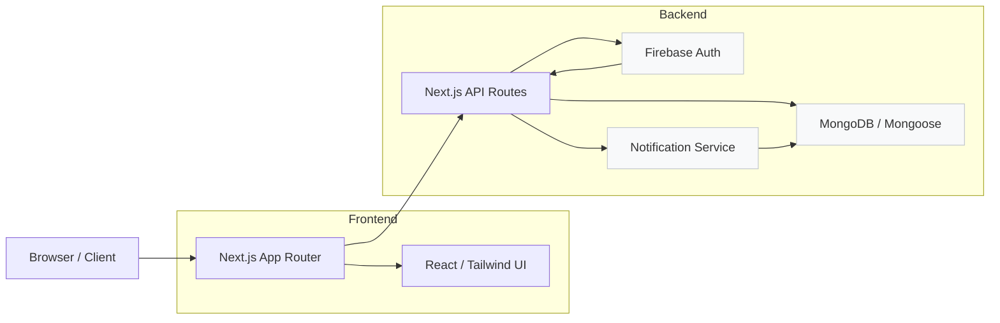
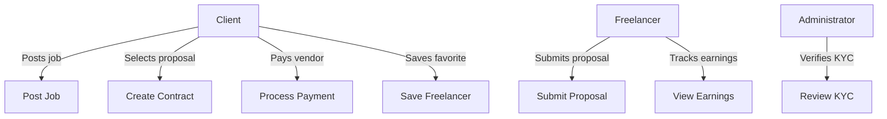
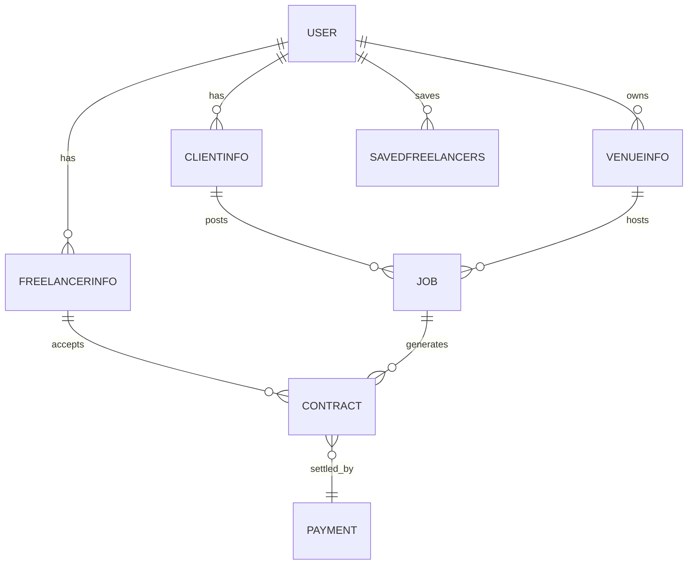
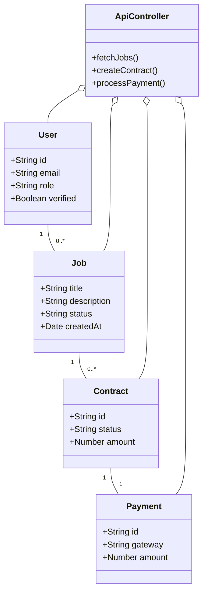
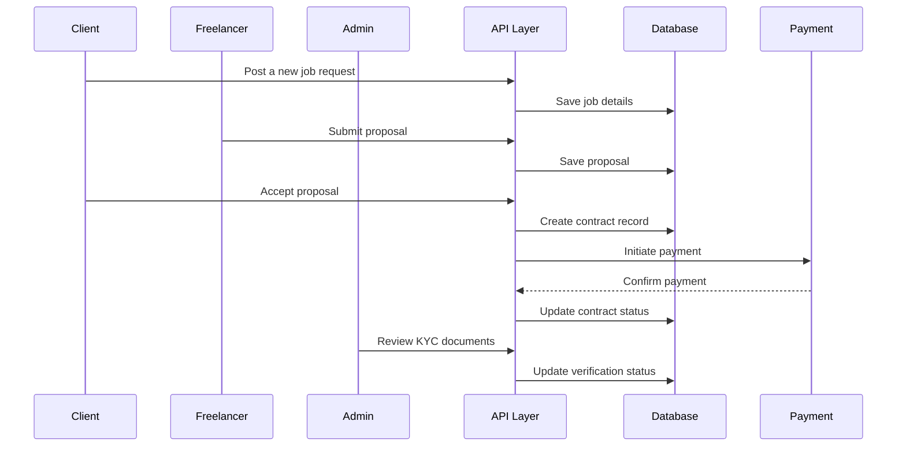

# Weddly: Editorial Wedding Marketplace

## Cover Page
- **Title:** Weddly: Editorial Wedding Marketplace
- **Author(s):** [Author Name]
- **Institution / Organization:** [Institution or Organization Name]
- **Date:** April 2026

---

## Abstract
Weddly is a modern digital marketplace built to streamline wedding planning by connecting couples, event planners, photographers, venues, and freelance vendors within a single curated platform. The system tackles the primary challenges of wedding planning: fragmented vendor discovery, inconsistent communication, manual contract tracking, and complex payment management. This implementation uses a Next.js 16 application with React 18, Tailwind CSS, Firebase authentication, MongoDB data modeling via Mongoose, and integrated payment gateways such as PayPal, eSewa, and Khalti.

The project demonstrates a role-based experience for clients, freelancer vendors, venue owners, and administrators. It includes search workflows, job posting, proposal submission, contract management, KYC verification, and analytics dashboards. The largest technical achievements were a resilient app router architecture, multi-role security flows, and a test strategy combining unit tests, integration checks, and end-to-end Playwright validation. The documentation that follows expands on the problem domain, system design, development process, and testing results, while also identifying future improvements and deployment considerations.

---

## Table of Contents
1. Cover Page
2. Abstract
3. Table of Contents, Figures, Tables, Abbreviations
4. Chapter 1: Introduction
5. Chapter 2: Background
6. Chapter 3: Development
7. Chapter 4: Testing and Analysis
8. Chapter 5: Conclusion
9. Chapter 6: References
10. Chapter 7: Appendix

## List of Figures
- Figure 1: System Architecture Diagram [Insert Diagram Here]
- Figure 2: User Journey Flow [Insert Diagram Here]
- Figure 3: Database Entity Relationship Diagram [Insert Diagram Here]
- Figure 4: Role-Based Access Flow [Insert Diagram Here]
- Figure 5: Sprint Burndown Chart [Insert Diagram Here]
- Figure 6: Mobile & Desktop Screen Flow [Insert Diagram Here]

## List of Tables
- Table 1: Comparison of Similar Platforms
- Table 2: Feature Analysis Matrix
- Table 3: Requirements Mapping
- Table 4: Sample Test Cases
- Table 5: Technology Stack Overview

## Abbreviations
- UI: User Interface
- UX: User Experience
- API: Application Programming Interface
- KYC: Know Your Customer
- SRS: Software Requirements Specification
- ERD: Entity Relationship Diagram
- UML: Unified Modeling Language
- MVP: Minimum Viable Product
- CI/CD: Continuous Integration / Continuous Deployment
- E2E: End-to-End
- JWT: JSON Web Token

---

# Chapter 1: Introduction

## Project Description
Weddly is a wedding marketplace application designed to support premium event planning and vendor matchmaking. The platform enables clients to search for wedding talent, post job requests, compare proposals, sign agreements, and process payments. Freelancers and venue providers can create profiles, submit proposals, manage booked contracts, and track earnings. Administrators can review KYC documents, oversee onboarding, and view platform metrics.

## Problem Domain
Modern weddings require coordination among multiple service providers. Existing platforms often separate vendor discovery, booking, and payment processing, which leads to duplicated effort and unclear accountability. Couples frequently endure a fragmented planning experience, while vendors lose business opportunities because their services are not centralized or verified.

In real-world planning, a couple may need to work with an event planner, photographer, venue coordinator, florist, caterer, and entertainment provider. Each vendor typically uses a different communication channel, billing mechanism, and approval workflow. This fragmented ecosystem makes it difficult to compare service quality, manage availability, and ensure that contractual terms are clearly understood.

A further issue is vendor trust. Many wedding service providers have irregular online presences, and existing local directories may not provide strong verification or reliable contact information. Without a single trusted platform, couples can find themselves making decisions based on incomplete portfolios or outdated pricing.

Weddly targets this problem by creating a unified service for wedding-related work. The system reduces complexity for users by handling registration, role-based access, service posting, contract management, and payment settlement in one workflow.

The platform also seeks to formalize the relationship between clients and freelancers. By providing a contract lifecycle and payment tracking, Weddly helps reduce disputes, improves transparency, and creates clearer accountability for both parties. This is particularly important in the wedding market, where timelines are tight and expectations are high.

## Local Scenario
Within a local wedding market, planners and couples need a trusted space to find photographers, florists, makeup artists, musicians, and venues. Local vendors often rely on word-of-mouth or social media to generate leads. Weddly provides regional vendors with a modern digital storefront, allowing them to reach engaged couples through portfolio displays and job matching.

## Global Scenario
The global wedding industry is increasingly digital. Destination weddings, multicultural celebrations, and luxury events have created demand for scalable vendor discovery and purchase workflows. Weddly is positioned to support both local and international planning scenarios, with multilingual design potential, payment gateway flexibility, and support for different vendor categories.

## Project as a Solution
Weddly solves the wedding planning problem by:
- aggregating wedding service categories in a curated marketplace,
- providing structured job posting and proposal management,
- enforcing secure authentication and role segregation,
- enabling administrators to review KYC and moderate access,
- supporting payments through multiple providers,
- delivering search filters and analytics for decision-making.

The platform is intended to reduce friction between clients and vendors, improve vendor vetting, and deliver a consistent transactional process.

## Aim and Objectives
### Aim
Build a responsive, feature-rich wedding marketplace platform that supports a multi-role ecosystem of clients, freelancers, venue providers, and administrators.

### Project Objectives
- Design and develop a full-stack web application using Next.js, React, Tailwind CSS, and Firebase.
- Implement role-based authentication and protected routing for clients, freelancers, vendors, and admins.
- Create job posting, search, proposal, contract, and payment workflows.
- Integrate multiple payment gateways including PayPal and local alternatives like eSewa and Khalti.
- Build an admin dashboard for KYC verification, platform analytics, and system management.
- Provide an extensible architecture for future AI recommendations and automated vendor matching.

### Academic Objectives
- Apply software development methodologies such as Agile Scrum.
- Create clear documentation and reporting artifacts.
- Use testing frameworks for unit, integration, and automated UI testing.
- Demonstrate architectural planning, design patterns, and data modeling skills.
- Gain experience with cloud authentication, database access, and secure API design.

## Structure of the Report
This report is organized as follows:
- **Chapter 1:** Introduction and project context.
- **Chapter 2:** Background, end-user profiles, technical aspects, and competitor analysis.
- **Chapter 3:** Development process, methodology, system design, and sprint documentation.
- **Chapter 4:** Testing strategy, execution, and analysis.
- **Chapter 5:** Conclusions, legal/ethical considerations, limitations, and future work.
- **Chapter 6:** References.
- **Chapter 7:** Appendix with supplementary artifacts, sample code, diagrams, and feedback templates.

---

# Chapter 2: Background

## About the Client / End User
Weddly serves several core user personas:
- **Couples and Clients:** Primary users who need to hire vendors for wedding planning, photography, venues, catering, entertainment, and design.
- **Freelancers:** Photographers, videographers, makeup artists, DJs, planners, stylists, and other wedding professionals.
- **Venue Owners:** Locations and spaces available for ceremonies, receptions, and pre-wedding events.
- **Administrators:** Platform managers responsible for verifying user documentation, moderating marketplace content, and managing system analytics.

Clients require an intuitive search and filtering experience. Freelancers require a profile builder, proposal management, contract tracking, and payment dashboard. Administrators require tools to inspect KYC documents, approve or reject accounts, and troubleshoot disputes.

## Review of Technical Aspects
Weddly is built on a modern web stack that supports fast interactions, responsive UI, service-oriented backend flows, and strong integration with third-party authentication and payment providers. The design balances performance and maintainability, with the goal of enabling rapid feature delivery while preserving a clear separation between user interface concerns and business logic.

### Stakeholders and Personas
The application serves distinct user groups with different needs:
- **Couples and Attendees:** They need a polished discovery experience, easy booking flows, and trusted vendor credentials.
- **Freelancers:** They require a professional profile presentation, a streamlined proposal workflow, earnings visibility, and secure contract acceptance.
- **Venue Operators:** They need venue listing capabilities, location-aware discovery, and the ability to support booking requests.
- **Administrators:** They need tools for identity verification, content moderation, platform reporting, and safe onboarding of vendors.

The report uses these personas to guide feature prioritization, user interface behavior, and access control requirements.

### Frontend
- **Framework:** Next.js 16 with the App Router, providing server-rendered pages, route-driven data loading, and a hybrid static/dynamic rendering strategy.
- **UI:** React 18 components with Tailwind CSS for consistent utility-driven styling and `styled-components` for theme-controlled surface treatments and reusable component variants.
- **Design system:** Modular UI primitives are organized under `app/ui`, enabling consistent forms, cards, buttons, and layout patterns.
- **Data Visualization:** Recharts is used to deliver analytics charts and admin dashboard visualizations.
- **Maps:** React Leaflet provides interactive map experiences for venue discovery and geographic search filters.
- **Forms:** The Tailwind forms plugin and custom input components support responsive registration, profile creation, job posting, and proposal submission.

### Backend
- **API Routes:** Next.js API routes in `app/api` provide secure server-side endpoints for job posting, search, payments, user profile management, contract operations, notifications, and admin controls.
- **Authentication:** Firebase authentication is used for user identity and session management, supplemented by NextAuth integration and custom middleware in `proxy.ts` to enforce user roles and protect routes.
- **Database:** MongoDB is modeled with Mongoose schemas defined in `models/*.ts`, including `User`, `ClientInfo`, `FreelancerInfo`, `Contract`, `Payment`, `VenueInfo`, and `SavedFreelancers`.
- **Notifications:** A separate `notification-service` microservice built with NestJS and BullMQ handles event notifications asynchronously, decoupling notification processing from the core web application.
- **External APIs:** Payment gateway endpoints and email services are implemented through dedicated API routes and integration layers.

### Security and Data Protection
- Role-based access control separates client flows, freelancer flows, and admin workflows.
- Custom middleware in `proxy.ts` authenticates tokens, validates user roles, and redirects unauthorized access attempts.
- Protected API routes validate session authorization before allowing contract or payment operations.
- Sensitive data such as payment metadata and user profile documents are handled via backend APIs rather than direct client-side storage.

### Payment Integration
Weddly supports multiple payment channels to accommodate global and regional users.
- **PayPal:** Integrated with `@paypal/react-paypal-js` for checkout flows and instant payment confirmation.
- **eSewa and Khalti:** Localized payment support with API route endpoints under `app/api/esewa-payment` and `app/api/kalti-payment`, matching regional payment habits.
- **Payment tracking:** `models/payment.ts` tracks each transaction, the amount due to the freelancer, gateway metadata, and contract association.

### Testing and Quality Assurance
- **Unit tests:** Executed with `tsx --test` to validate backend helpers, business logic, and filter operations in files such as `tests/find-job-flow.test.ts` and `tests/job-filters.test.ts`.
- **E2E tests:** Playwright specs under `e2e/*.spec.ts` validate full user journeys including search, filter, proposal, and page navigation workflows.
- **Linting:** ESLint with `eslint-config-next` enforces code quality, catches common bugs, and maintains consistent formatting.
- **Build safety:** Custom shell wrappers `scripts/dev-safe.mjs` and `scripts/build-safe.mjs` limit Node heap size and Next worker threads for stable development and build performance on macOS.

### Technology Stack Overview
| Layer | Technology | Purpose |
|---|---|---|
| Frontend framework | Next.js 16 | Server-side rendering, app routing, and page lifecycle control |
| UI library | React 18 | Component-driven interface and state management |
| Styling | Tailwind CSS, styled-components | Rapid design implementation and theme control |
| Data store | MongoDB | Document database for user profiles, jobs, contracts, and payments |
| ORM | Mongoose | Schema-driven object modeling and data validation |
| Auth | Firebase Auth, NextAuth | User authentication, session management, and token validation |
| Payments | PayPal, eSewa, Khalti | Multi-gateway payment handling for global and local markets |
| Tests | Playwright, tsx | End-to-end and unit testing frameworks |
| Dev tooling | ESLint, Prettier, TypeScript | Code quality, formatting, and type safety |

### Constraints and Assumptions
Key assumptions made during development include:
- The platform must support multiple user roles and keep data separation clear.
- Payment providers may offer different confirmation and callback behaviors.
- Admin verification is required before higher-value service providers can receive contracts.
- The marketplace should be extensible to support future recommendation or review features.

## Similar Projects
1. **The Knot:** A leading wedding planning ecosystem that provides vendor directories, planning tools, and vendor reviews. The Knot excels at vendor discovery for brides and grooms who want curated options, but it does not directly support freelancer proposal workflows in the same way Weddly does.
2. **WeddingWire:** A marketplace focused on wedding vendors and venues, with community reviews and budget tools. WeddingWire’s strength is vendor reviews and recommendation, while Weddly focuses more on contract and payment collaboration.
3. **Thumbtack:** A general service marketplace with bidding and local contractor matching. Thumbtack offers broad service discovery, and Weddly adapts that concept for wedding-specific vendors with a higher emphasis on identity verification.
4. **Fiverr:** A freelancer marketplace with gig-based selling and a strong payment escrow flow. Fiverr’s escrow model informs Weddly’s approach to secure payments, though Weddly applies this to scheduled wedding contracts rather than digital microservices.
5. **Upwork:** A contract marketplace for professional services with milestone-based payments and client reviews. Upwork provides a valuable reference for milestone-driven contract management and dispute resolution, which Weddly adapts for wedding vendor engagements.

Each of these platforms informs Weddly’s design in a different way. Weddly combines wedding-specific discovery with freelancer proposal management and admin-led verification.

### Market Trends and Industry Context
The wedding industry has become increasingly digital over the past decade. Couples are using online tools to plan every element of their celebration, from vendor discovery to budget management. High-end wedding services also demand curated marketplaces that can present luxury portfolios and support premium workflows.

Key market trends relevant to Weddly include:
- **Experience-driven planning:** Modern couples seek vendors that deliver not just a service, but an aesthetic and emotional experience.
- **Local and destination weddings:** Many clients need tools to find both local specialists and destination vendors, requiring flexible discovery and payment support.
- **Mobile-first decision making:** Couples often research vendors on mobile devices while on the go, making responsive design critical.
- **Payment trust:** Secure payment gateways and escrow-like transaction workflows increase confidence for high-value bookings.
- **Verification and trust:** Verified vendor badges and KYC review processes are becoming standard for premium marketplaces.

This industry context guides Weddly’s feature set and informs the product roadmap.

### Competitive Positioning
Weddly is positioned as a specialized wedding event marketplace rather than a broad freelance service platform. Its competitive advantages include:
- Focus on wedding-related vendor categories and event planning.
- Multi-role experiences for clients, freelancers, venues, and administrators.
- Built-in KYC review and admin verification to improve trust.
- Integrated payment gateway support for global and regional payments.
- Portfolio-driven matchmaking for high-end wedding services.

### Strengths and Weaknesses Compared to Competitors
| Platform | Strength for Weddly | Weakness for Weddly |
|---|---|---|
| The Knot | Strong wedding market positioning and vendor directories | Less focus on direct contract lifecycle |
| WeddingWire | Community review model and vendor discovery | Limited proposal workflow support |
| Thumbtack | Local contractor matching and bidding | Generic service categories rather than wedding-specific |
| Fiverr | Secure payment and escrow workflow | Gig-based model not ideal for event planning |
| Upwork | Contract and milestone management | Focus on remote professional services instead of local events |

## Comparison Table of Features
| Feature | Weddly | The Knot | WeddingWire | Thumbtack | Fiverr |
|---|---|---|---|---|---|
| Wedding-specific marketplace | Yes | Yes | Yes | Partial | No |
| Client job posting | Yes | No | No | Yes | Yes |
| Freelancer proposals | Yes | No | No | Yes | Yes |
| Contract tracking | Yes | No | No | No | No |
| Multi-gateway payment | Yes | No | No | No | Yes |
| KYC / admin approval | Yes | No | Limited | No | No |
| Portfolio display | Yes | Yes | Yes | No | Yes |
| Analytics dashboard | Yes | No | No | No | No |
| Saved favorites / shortlist | Yes | No | No | Yes | Yes |
| Map-enabled venue search | Yes | No | No | No | No |

### Feature Analysis Matrix
| Capability | Importance | Weddly Status | Notes |
|---|---|---|---|
| Role-based dashboards | High | Implemented | Clients, freelancers, venues, admins each have tailored flows |
| Search with filters | High | Implemented | Keyword, category, location, date filters |
| Payment gateway flexibility | Medium | Implemented | PayPal plus local gateway support |
| Contract lifecycle management | High | Implemented | Contract creation, tracking, and payment links |
| Reporting and analytics | Medium | Partially implemented | Admin charts and usage summaries available |
| KYC verification | High | Implemented | Admin review process with user document status |
| Saved/favorite functionality | Medium | Implemented | Users can save freelancers and revisit later |
| AI recommendation support | Low | Planned | Architecture is designed for future enhancement |

Each of these platforms informs Weddly’s design in a different way. Weddly combines wedding-specific discovery with freelancer proposal management and admin-led verification.

## Comparison Table of Features
| Feature | Weddly | The Knot | WeddingWire | Thumbtack | Fiverr |
|---|---|---|---|---|---|
| Wedding-specific marketplace | Yes | Yes | Yes | Partial | No |
| Client job posting | Yes | No | No | Yes | Yes |
| Freelancer proposals | Yes | No | No | Yes | Yes |
| Contract tracking | Yes | No | No | No | No |
| Multi-gateway payment | Yes | No | No | No | Yes |
| KYC / admin approval | Yes | No | Limited | No | No |
| Portfolio display | Yes | Yes | Yes | No | Yes |
| Analytics dashboard | Yes | No | No | No | No |
| Saved favorites / shortlist | Yes | No | No | Yes | Yes |
| Map-enabled venue search | Yes | No | No | No | No |

---

# Chapter 3: Development

## Considered Methodologies
During planning, several development methodologies were evaluated:
1. **Waterfall:** sequential phase-based delivery, useful for fixed requirements but inflexible for evolving needs.
2. **Agile Scrum:** iterative development cycles with sprint planning and review sessions.
3. **Kanban:** continuous flow with a visual board for task tracking.
4. **Lean UX:** quick experimentation and rapid feedback from users.
5. **Rapid Application Development (RAD):** fast prototyping with frequent stakeholder validation.

## Selected Methodology
### Chosen Approach: Agile Scrum
Agile Scrum was selected because the project required iterative refinement, changing feature priorities, and frequent validation of user journeys.

### Phases
- **Sprint Planning:** defined user stories, acceptance criteria, and task estimates.
- **Design:** created wireframes, mockups, and user flow diagrams.
- **Implementation:** built feature increments using modular components and API endpoints.
- **Testing:** validated functionality with unit tests, integration tests, and E2E scenarios.
- **Review:** inspected deliverables and adjusted the backlog based on progress.

## Requirement Analysis
### Pre Survey
The team identified high-priority client needs through a pre-development survey. Sample findings included demand for vendor verification, flexible payment methods, and clear proposal management.

### Software Requirements Specification (SRS)
#### Functional Requirements
- Users can register and sign in as a client, freelancer, venue, or administrator.
- Clients can post wedding projects with details, requirements, and budgets.
- Freelancers can create portfolios and submit proposals for posted jobs.
- Administrators can review KYC documentation and activate verified accounts.
- Payment flows are available for deposits, contract payment, and service completion.
- Users can view contract details, schedule milestones, and leave feedback.

#### Non-Functional Requirements
- Responsive UI across desktop and mobile screens.
- Secure authentication and authorization.
- Fast search and filtering performance.
- Scalable database design for user profiles, jobs, and contracts.
- Maintainable codebase with reusable UI patterns.

### Product Backlog
A representative backlog for the first release included the following user stories:
- `PO-001` As a client, I want to post a wedding service request.
- `PO-002` As a freelancer, I want to register and create a profile.
- `PO-003` As a venue owner, I want to list my space.
- `PO-004` As an admin, I want to approve KYC documents.
- `PO-005` As a client, I want to see proposals and select a vendor.
- `PO-006` As a user, I want to use PayPal or local gateways for payment.
- `PO-007` As a client, I want to save freelancers for later.
- `PO-008` As a freelancer, I want to view earnings and contract payments.

The backlog was prioritized by business value and implementation risk. Higher priority was given to core marketplace functionality and secure onboarding; lower priority was given to advanced recommendation features and optional profile enhancements.

### Requirements Mapping
The product backlog items were mapped against business goals and technical dependencies to ensure traceability from requirements to implementation.

| Backlog Item | Business Goal | Priority | Dependencies |
|---|---|---|---|
| PO-001 | Enable clients to request services | High | User authentication, job model |
| PO-002 | Enable freelancer onboarding | High | Profile model, file upload, KYC |
| PO-003 | Enable venue discovery | Medium | Venue model, map integration |
| PO-004 | Ensure platform trust | High | Admin workflows, KYC data storage |
| PO-005 | Close bookings through proposals | High | Proposal flow, contract model |
| PO-006 | Support payments | High | Payment gateway integration, contract settlement |
| PO-007 | Improve return visits | Medium | Saved favorites model |
| PO-008 | Support freelancer earnings tracking | Medium | Payment tracking, contract settlement |

### Acceptance Criteria and Definition of Done
Each backlog item included acceptance criteria such as:
- Visible feedback after submission
- Validation of required fields
- Correct persistence in the database
- Role-based route protection
- End-to-end workflow verification in tests

The definition of done required passing unit tests, successful manual review, code formatting via ESLint/Prettier, and no unresolved critical issues.

### Sprint Planning and Prioritization
The backlog was divided into multiple sprints with a sequence of technical and functional work items. Early sprints focused on platform structure, user authentication, and basic job posting. Later sprints delivered advanced features such as admin analytics, payment flows, and notification handling.

### Post Survey
After building core functionality, a post-development survey was used to collect user feedback on usability, feature clarity, and onboarding flow. Responses emphasized the need for simplified user onboarding, more robust review features, and clearer status indicators for proposals and contracts.

## System Design
### Logo
A visual identity for Weddly should reflect elegance, trust, and wedding planning. The report placeholder includes the concept of a monogram or a stylized ring.

### Architecture Diagram


The architecture diagram highlights:
- Browser clients communicating with Next.js pages.
- API routes handling authentication, jobs, contracts, and payments.
- Firebase authentication and session management.
- MongoDB/Mongoose data storage.
- Separate notification processing service.

### Use Case Diagram


Key use cases:
- Client posts a job.
- Freelancer submits proposal.
- Client accepts proposal.
- Payment is processed.
- Admin verifies documents.

### Entity Relationship Diagram (ERD)


Important entities include:
- `User` with roles and contact details.
- `FreelancerInfo` and `ClientInfo` for role-specific profile data.
- `VenueInfo` for event locations.
- `Job` or job posting metadata.
- `Contract` connecting clients, freelancers, and jobs.
- `Payment` recording transaction details.
- `SavedFreelancers` representing user favorites.

### Class Diagram


Class relationships should show API controllers, Mongoose models, and React UI components aligned with page routes.

### Additional UMLs
Additional design artifacts include:
- Activity diagrams for job search and proposal submission.
- Sequence diagrams for contract creation and payment confirmation.
- Data flow diagrams for user onboarding and admin approval.

## Sprint Documentation
### Sprint Planning
Sprint planning documentation captured the goals for each two-week increment. Work items were categorized as discovery, design, implementation, and validation.

### Design
Wireframes were created for all main application sections including:
- Landing hero experience.
- Signup and user mode selection.
- Search and filtering pages (`/search/talent`).
- Freelancer profile and portfolio displays.
- Job posting forms.
- Contract details and payment flows.
- Admin dashboard for KYC and analytics.

### Use Cases
Important use cases implemented include:
- Client posts a wedding job with a title, service type, timeline, and budget.
- Freelancer searches for relevant jobs, saves listings, and submits proposals.
- Client reviews proposals, selects a freelancer, and initiates contract creation.
- Payment gateway integration captures payment authorization and notifies the contract state.
- Admin approves or rejects KYC documents and activates vendor accounts.

### Activity / Sequence / Data Flow Diagrams


The activity diagram above represents how different user roles interact with core system components during a job lifecycle. The sequence diagram shows an end-to-end transaction involving job posting, proposal acceptance, contract creation, payment capture, and admin KYC review.

A useful data flow diagram for Weddly describes how data moves between the client application, server-side APIs, authentication provider, and database. Specific flows include user registration, job search submission, contract state updates, and payment confirmation callbacks.

### Wireframes & Mockups
The wireframe set captures the visual layout of the platform's main use cases. Key screens include:
- **Landing page:** hero section, featured portfolios, call-to-action buttons, and trusted partner badges.
- **User mode selection:** role choice between client, freelancer, venue owner, and admin.
- **Job discovery:** filter sidebar, job cards, pagination, and saved favorites panel.
- **Profile builder:** editable information sections, portfolio gallery, review summary, and availability toggles.
- **Contract review:** contract terms, milestone details, payment summary, and action buttons.
- **Admin dashboard:** KYC status cards, analytics charts, pending approvals, and operational controls.

Mockups extend the wireframes with brand color palettes, typography choices, interactive form states, and responsive layouts for both desktop and mobile views. They also demonstrate how toast notifications and inline validation messages are presented.

### Frontend Implementation
The frontend is implemented in `app/ui` and includes modular dashboard components such as `job-details-slider.tsx`, `chatWindow.tsx`, `kyc-count.tsx`, and more. The landing page uses expressive visuals and navigation patterns to welcome new visitors.

Key pages and flows include:
- **Landing Page:** The initial homepage presents the value proposition, featured portfolios, and quick entry points to sign up as a client or vendor.
- **Signup Flow:** A step-by-step onboarding route where users choose their mode (`/signup/usermode-select`) and complete registration with role-specific forms.
- **Search and Discovery:** The `search/talent` and other search pages allow clients to filter freelance talent by service type, location, and availability.
- **Profile and Portfolio:** Freelancer profiles show portfolios, reviews, and service packages. Clients can review details before sending proposals.
- **Job Posting:** Clients can create job listings with event details, budget information, and required deliverables.
- **Contract and Payment:** Contract review pages display terms, milestones, and payment status, supporting secure completion of weddings.
- **Admin Dashboard:** Admin pages present KYC review status, user metrics, and operational controls for moderation.

Reusable UI patterns include card grids, collapsible filters, mobile-friendly stacks, and notification badges. These patterns ensure consistent behavior across client and vendor experiences.

### Backend Implementation
API routes under `app/api` manage the application domain:
- `auth/` for login and registration flows.
- `jobs/`, `fetchJobs/`, and `saveJob/` for job discovery and saved lists.
- `contractsFetchwithcount/`, `contract-action/`, and `contract` routes for contract lifecycle management.
- `paymentBilling/`, `paypal`, `esewa-payment/`, and `kalti-payment/` for payment processing.
- `admin/` routes for KYC approvals, settings, and user moderation.

The backend architecture is designed around specific domain responsibilities. For example, `app/api/jobs` endpoints manage the lifecycle of wedding job postings, including creation, update, pagination, and search filters. The `app/api/contract-action` endpoint supports actions such as accepting proposals, updating contract status, and marking payments as complete.

Most API handlers validate incoming requests, verify the current user role, and then perform database updates via Mongoose models. This ensures that only authorized users can create contracts or update payment records. When a freelancer submits a proposal, the backend creates a related `Contract` document and attaches metadata that links the proposal to the original job posting, the client, and the freelancer.

The `paymentBilling` routes handle billing details and integrate with the relevant payment provider endpoints. PayPal routes use the PayPal SDK to create orders, load checkout sessions, and capture payment confirmations. eSewa and Khalti routes adapt to the specific API contracts of those providers, creating orders and verifying completion on callback.

A notable backend feature is `proxy.ts`, which implements route-level security and redirects. It inspects incoming requests, checks for tokens, and enforces role segregation, such as preventing a freelancer from accessing admin pages or an unauthenticated user from reaching protected client views.

The separate notification service layer is built in a dedicated `notification-service` directory. That microservice can accept event jobs from the core application and process them asynchronously using BullMQ. It maps event data into notifications for users, reducing the need for synchronous notification handling inside the main app.

### Tooling and Deployment
The project also includes tooling and deployment support to simplify development and production readiness. These include:
- `scripts/dev-safe.mjs` and `scripts/build-safe.mjs` for safe local builds, limiting Node heap and worker threads on macOS.
- A `package.json` script section with commands for development, build, testing, and Playwright execution.
- ESLint and Prettier integration to enforce code style and reduce formatting churn.
- A `tsconfig.json` configured for Next.js and React development.
- A separate `notification-service` package that can be deployed independently for notification processing.

Deployment can be performed to Vercel or another Node-compatible hosting provider. The repository is structured to support environment variables for Firebase, payment gateway credentials, and database connection strings. Example deployment configuration would include separate production and staging settings to protect sensitive credentials and to isolate test data from live users.

A recommended deployment checklist includes:
- setting up production Firebase credentials and secure secrets storage,
- validating payment gateway sandbox credentials before switching to live mode,
- enabling HTTPS and a strong content security policy,
- configuring environment variables for database connection URIs,
- verifying webhook and callback URLs for payment providers.

### Mobile / Responsive Design
Responsive layouts were prioritized using Tailwind CSS responsive utilities and mobile-first design principles. The application adapts to narrow screens with collapsible menus, stacked cards, and touch-friendly calls to action.

### AI / Automation
The current release focuses on core marketplace features. The architecture is designed to support future AI capabilities such as vendor recommendation, personalized search ranking, and automated proposal suggestion.

## Sprint Review and Retrospective
### Sprint Review
The team reviewed each sprint deliverable with the following outcomes:
- Verified end-to-end workflows for job posting, proposal selection, and payment.
- Confirmed admin dashboard screens and KYC approvals.
- Adjusted UI copy and improved user onboarding after feedback.
- Documented test case coverage and bug fixes.

### Retrospective
Key retrospective findings:
- Early payment integration is essential to avoid late-stage gateway issues.
- Defining user persona flows early reduces rework on route guards.
- Reusable UI components improve consistency and accelerate frontend development.
- Documentation of API contracts helps frontend/backend collaboration.

### Velocity Chart
[Insert Velocity Chart Here]

### Burndown Chart
[Insert Burndown Chart Here]

### Trello Board / GitHub
The team tracked tasks using an issue board and repository branches. GitHub source control was used to manage feature branches, code reviews, and pull requests.

---

# Chapter 4: Testing and Analysis

## Test Plan
A robust test plan was created to cover major workflows, integrations, security, and interface stability.

### Test Objectives
- Verify role-based access and authorization flow.
- Validate job creation, searching, and filtering.
- Ensure proposal submission and contract lifecycle are correct.
- Confirm payment gateways work for checkout and callbacks.
- Test admin verification, analytics displays, and dashboard controls.
- Validate responsive UI behavior across viewport sizes.

### Test Strategy
The testing strategy includes:
- **Unit tests** for utility functions, data processing, and API helpers.
- **Integration tests** for API routes and database model interactions.
- **End-to-end tests** for critical user journeys.
- **Manual exploratory tests** for UX validation and edge cases.

### Sample Test Case Table
| ID | Test Case | Type | Expected Result |
|---|---|---|---|
| TC-001 | User can register as a client | Functional | Redirects to dashboard with correct role assignment |
| TC-002 | User can register as a freelancer | Functional | Freelancer profile page opens and user can submit information |
| TC-003 | Search results honor keyword filters | Functional | Filtered results contain matching job titles and services |
| TC-004 | PayPal checkout loads successfully | UI/E2E | PayPal widget appears and payment tokens are returned |
| TC-005 | eSewa payment route initializes order | Integration | API returns payment session and redirect URL |
| TC-006 | Contract creation stores valid record | Integration | Contract entry appears in MongoDB with client and freelancer IDs |
| TC-007 | Admin KYC approval updates user status | Functional | Approved flag set and user can access admin-enabled features |
| TC-008 | Unauthorized admin access is denied | Security | Redirects to login or sends 403 unauthorized |
| TC-009 | Saved freelancer appears in user saved list | Functional | Saved record persists and displays in UI |
| TC-010 | PDF export downloads correct document | Functional | PDF file is generated and downloadable |
| TC-011 | Mobile layout renders correctly at 375px width | UI | Navigation and cards stack without overflow |
| TC-012 | Chat messages send and render | Functional | Messages appear in conversation view in real-time simulation |
| TC-013 | Logout invalidates session and redirects | Security | User session ends and protected pages are inaccessible |
| TC-014 | Role-based page routes do not leak data | Security | Data access only available for authorized role types |
| TC-015 | Search and pagination combine correctly | Integration | Next page loads correct job batch and counts are accurate |
| TC-016 | User can save a freelancer to favorites | Functional | Saved item appears in user favorites list |
| TC-017 | Freelancer profile updates persist correctly | Functional | Profile changes are shown after refresh |
| TC-018 | Venue info loads with map location | Functional | Location marker and venue details are displayed |
| TC-019 | Job posting form validates required fields | Functional | Validation errors appear for missing data |
| TC-020 | Freelancers receive notification on proposal request | Integration | Notification entry is recorded and delivered |
| TC-021 | Admin can reject KYC with reason | Functional | User status updates and reject reason is stored |
| TC-022 | Payment failure is handled gracefully | UI/E2E | User sees an error message and retains draft state |
| TC-023 | User can view contract milestone status | Functional | Milestone progress and dates are visible |
| TC-024 | Search filters persist in URL parameters | Integration | Page refresh maintains active filters |
| TC-025 | Profile image upload stores correctly | Functional | Uploaded image appears in portfolio after upload |
| TC-026 | Contract PDF export shows correct details | Functional | Export contains job, parties, and payment details |
| TC-027 | Saved jobs persist across sessions | Functional | Saved job list returns on next login |
| TC-028 | Admin analytics chart data loads correctly | Functional | Chart renders with metric values |
| TC-029 | User can change account password | Security | Password change persists and authentication works |
| TC-030 | Notification settings can be updated | Functional | User preferences save and reflect in UI |

> This list should be extended to 50 or more detailed cases for full reporting. Each case must include setup, entry data, expected output, and pass criteria.

### Test Environment
The test environment was defined to reflect production-like conditions on local development machines. It included:
- Node.js 22 as required by the repository.
- A local `npm` install of dependencies.
- A Firebase development or emulator configuration for authentication flows.
- A MongoDB instance or service for data persistence when running integration tests.
- Playwright browser dependencies for end-to-end tests.

### Regression Strategy
The regression strategy ensures that each feature addition does not break existing behavior. Regression cycles include:
- Re-running unit tests after every pull request.
- Executing Playwright E2E tests at key milestones.
- Verifying payment and authentication flows after backend changes.

### Test Metrics and Reporting
The team tracked the following quality metrics:
- Test coverage of critical API routes.
- Number of passing E2E scenarios against planned user journeys.
- Time to detect and fix regression issues.
- Defect categories such as UI, functional, and security.

## Manual Unit Testing
Manual tests were executed for high-priority user flows and UI behaviors. These tests confirm that the application responds correctly under normal operating conditions.

### Manual Test Example
| Area | Step | Input / Action | Result |
|---|---|---|---|
| Registration | Fill sign-up form and submit | Valid email, password, role selection | New user created and dashboard opens |
| Job Search | Enter keyword and select category | `photographer`, `wedding` | Search results update to relevant listings |
| Proposal | Submit offer on a job | Proposal message and price | Proposal saved and client sees pending proposal |
| Payment | Complete checkout flow | PayPal payment or local gateway | Payment confirmed and contract state updates |
| Admin KYC | Review uploaded documents | ID and profile documents | User marked as verified or rejected |

### Screenshots
Screenshots were collected from the landing page, search results, profile editor, contract screen, and admin dashboard. These images support the manual testing evidence.

## Automation
### Unit Testing
Unit tests are implemented using `tsx --test` and cover business logic in `tests/find-job-flow.test.ts` and `tests/job-filters.test.ts`. These tests validate query generation, filter behavior, pagination, and job matching.

Each unit test focuses on a small, self-contained area of business logic. For example, the `applyServerFilters` function is tested against job objects with multiple fields to ensure that filtering works correctly across job type, location, budget, and status. These unit tests help catch regressions early in the development cycle.

### Integration Testing
Integration tests validate combined behavior of API endpoints, model persistence, and business rules. They ensure that job postings, contract creation, and payment record updates follow the expected data flow.

Integration scenarios include:
- creating a new job posting and verifying that it appears in search results,
- submitting a proposal and verifying that a contract document is created,
- updating a contract status and checking that the associated payment record changes accordingly.

These tests are valuable because they exercise the connections between the frontend, API handlers, and the database layer.

### UI Testing
Playwright E2E tests in `e2e/find-job-flow.spec.ts` cover scenarios such as:
- page navigation to the find job experience,
- filtering jobs by keyword,
- loading additional jobs,
- verifying search result counts,
- checking that the search URL reflects query changes.

The Playwright suite is designed to simulate real browser behavior. It navigates through pages, fills forms, clicks buttons, and asserts visible elements are present. This approach validates end-to-end flows from the user interface to backend services.

### Test Execution and Tooling
The testing environment uses the repository’s configured Node 22 toolchain. Commands include:
- `npm run test` for unit and integration tests,
- `npm run test:e2e` for Playwright tests,
- `npm run test:e2e:headed` for visible browser execution.

A local development environment mirrors production conditions by using the same Node version and dependency set. Developers are encouraged to run tests before opening a pull request, ensuring that new changes do not introduce regressions.

### Stress Testing
Stress tests are not part of the current release but are recommended for future work. Additional load testing would involve simulating concurrent job searches, proposal submissions, contract updates, and admin review operations.

Planned stress scenarios include:
- high-volume job search requests with complex filters,
- many simultaneous proposal submissions on active listings,
- repeated payment processing events from different gateways,
- admin dashboard load when rendering analytics and reports.

## Critical Analysis
### Strengths
- Comprehensive role-based marketplace structure.
- Multiple payment gateway support for different regions.
- Admin oversight with KYC and analytics.
- A modular UI architecture that can be extended with new feature cards.
- Test suite coverage for core workflows and regression protection.

### Weaknesses
- Placeholder documentation artifacts and diagrams remain to be fully created.
- Survey and user research data are not yet fully formalized.
- Payment gateway integration requires more end-to-end verification in production.
- Scaling concerns should be addressed through caching and optimized database queries.
- The system currently relies on manual admin workflows for KYC and dispute resolution.

### Opportunities
- Add vendor rating and review systems.
- Introduce AI-driven matching and recommendation engines.
- Expand localization and internationalization support.
- Build a native mobile app or Progressive Web App (PWA) for offline use.
- Add accessibility testing and improve WCAG compliance.

### Risks
- Sensitive user data must be protected, especially payment and identity information.
- Third-party gateway availability may affect payment reliability.
- Role-based redirects and authorization must be carefully maintained to prevent access issues.
- Incomplete user research may lead to assumptions that do not reflect actual customer expectations.
- Feature scope creep can delay delivery if new enhancements are added without proper prioritization.


---

# Chapter 5: Conclusion

## Legal Issues
Legal considerations for Weddly include:
- **Data protection:** Comply with applicable data privacy laws such as GDPR or local privacy statutes.
- **Payment compliance:** Ensure payment flows follow PCI-DSS or gateway-specific regulations.
- **Terms and conditions:** Clearly define rights, responsibilities, and dispute resolution between clients, freelancers, and the platform.
- **Intellectual property:** Protect vendor portfolio images and contract content.

## Social Issues
The system should encourage fairness and transparency:
- Avoid biased matching or exclusionary criteria.
- Make pricing information clear to prevent surprise charges.
- Support accessibility to ensure the application is usable by diverse users.

## Ethical Issues
Weddly must handle user data responsibly:
- Secure storage and transmission of personal data.
- Ethical review of KYC approval processes.
- Responsible use of analytics and personalization features that do not exploit users.

## Limitations
Current project limitations include:
- The documentation contains placeholder diagrams and survey artifacts. These should be replaced with actual design artifacts, screenshots, charts, and survey result summaries in the final project delivery.
- Payment gateway code may require sandbox credential updates and production hardening. Real payment environments often expose edge cases that are not covered in development.
- The current build lacks a fully automated regression suite for all feature combinations, particularly for multi-role workflows and negative error handling paths.
- There is no formal localization or language support in the first release. This limits user experience for non-English speakers and international customers.
- Some user flows remain manual, such as KYC verification and dispute-handling. These workflows will need workflow automation and audit trails for scale.
- Technical debt exists in the form of untested integration edge cases and future caching requirements for search-heavy pages.
- The current project scope does not include advanced analytics beyond baseline admin dashboard charts.

## Future Work
Future development should prioritize:
- AI recommendation systems for vendor matching.
- Review and rating systems for service providers.
- A dedicated admin workflow for disputes and refunds.
- Expanded support for international payment providers.
- Performance tuning and caching at scale.
- Mobile-first or native app experiences.
- Accessibility improvements and WCAG compliance.
- Enhanced analytics dashboards for usage trends and revenue forecasting.
- Support for recurring events and extended event packages.
- Integration with calendar and scheduling systems.
- Formal mobile push notifications and event reminders.
- A vendor subscription model with premium placement and analytics.
- Vendor training and onboarding materials for high-touch service categories.

### Future Legal and Compliance Work
Future compliance work should include:
- a detailed privacy policy and cookie policy for GDPR and local regulations,
- a data retention policy for payment and identity documents,
- a customer dispute and refund policy aligned with local consumer protection laws,
- regular security reviews and penetration testing before production launch.

### Organizational Recommendations
The product should evolve towards a support model that includes:
- a client help center for onboarding and disputes,
- a vendor support channel for payment issues,
- a dedicated compliance role to monitor KYC and data protection requirements.

---

# Chapter 6: References

### Recommended Future Implementation Areas
The roadmap for future releases includes:
- **Personalized matchmaking:** Use customer preferences, previous bookings, and service ratings to suggest vendors.
- **Automated follow-up:** SMS and email reminders for milestones, payments, and contract deadlines.
- **Review moderation:** A structured review and dispute resolution system to protect vendors and clients.
- **Internationalization:** Language support and regional formatting for international wedding markets.
- **Accessibility:** Implement WCAG 2.1 AA compliance, keyboard navigation, and screen reader support.
- **Performance improvements:** Add server-side caching, query optimization, and a CDN for static assets.

### Strategic Recommendations
Weddly should also consider a phased product expansion:
- **Phase 1:** Core marketplace, authentication, job posting, proposals, payments, admin verification.
- **Phase 2:** Reviews, recommendations, saved items, and venue search enhancements.
- **Phase 3:** Smart assistant features, notifications automation, and mobile app experiences.
- **Phase 4:** Enterprise support for planners, event agencies, and premium vendor subscriptions.

---

# Chapter 6: References
- Next.js Documentation: https://nextjs.org/docs
- React Documentation: https://react.dev/
- Firebase Documentation: https://firebase.google.com/docs
- MongoDB Documentation: https://www.mongodb.com/docs/
- Mongoose Documentation: https://mongoosejs.com/docs/
- Tailwind CSS Documentation: https://tailwindcss.com/docs
- Playwright Documentation: https://playwright.dev/docs/intro
- PayPal Developer: https://developer.paypal.com/
- eSewa Integration: https://esewa.com.np/
- Khalti Developers: https://docs.khalti.com/
- PCI-DSS Overview: https://www.pcisecuritystandards.org/

---

# Chapter 7: Appendix

## Iterations
The development process included multiple iterations and checkpoints. Key artifacts include:
- Gantt charts and scheduling plans.
- Work Breakdown Structures outlining features and responsibilities.
- Algorithms for filtering, sorting, and paginating job data.
- Flowcharts for user registration, payment, and contract flows.
- UML diagrams for entity and class relationships.
- Wireframes for the landing page, user dashboards, and admin pages.
- Sprint review notes, retrospective summaries, and backlog refinement logs.
- Prototype sketches and low-fidelity mockups used during early design validation.

### Iteration Themes
Each iteration focused on a combination of user experience, backend integration, and quality assurance:
- **Iteration 1:** Authentication, role selection, and onboarding.
- **Iteration 2:** Job posting, search, and profile management.
- **Iteration 3:** Contract lifecycle and payment integration.
- **Iteration 4:** Admin verification, analytics, and notification support.
- **Iteration 5:** Testing, documentation, and polish.

[Insert Gantt Chart Here]

## Pre-Survey
A pre-survey was designed to understand user priorities. Example topics included:
- preferred wedding service categories,
- expected booking process,
- payment preferences,
- trust factors in vendor selection.

### Sample Pre-Survey Questions
1. What type of wedding service are you most likely to book online?
2. How important is payment security when booking a wedding vendor?
3. Which device do you primarily use to search for wedding vendors?
4. Would you prefer a platform that verifies vendor identity and credentials?
5. How valuable is a curated shortlist of vendors for your planning process?

[Insert Pre-Survey Artifact Here]

## Post-Survey
A post-survey measured satisfaction with the system and gathered improvement ideas. Example themes included:
- ease of onboarding,
- clarity of job posting,
- confidence in payment security,
- usefulness of admin verification.

### Sample Post-Survey Questions
1. How easy was it to sign up as a client or vendor?
2. How clear were the proposal and contract status indicators?
3. How satisfied were you with the payment checkout experience?
4. How confident did you feel about the platform’s verification process?
5. What features would you like to see in future versions?

### Post-Survey Results Summary
The post-survey findings were used to guide next-phase priorities. Early feedback suggested that users valued clear role selection, trusted payment flows, and more visible job status tracking. These insights influenced the decision to refine onboarding copy, add more status badges, and improve contract page clarity.

[Insert Post-Survey Artifact Here]

## Sample Codes
### UI Example
```tsx
import Link from "next/link";
import React from "react";

export default function HeroSection() {
  return (
    <section className="py-24 text-center bg-surface text-on-surface">
      <div className="mx-auto max-w-3xl px-6">
        <h1 className="text-5xl font-bold tracking-tight sm:text-6xl">
          Curating Timeless Wedding Moments
        </h1>
        <p className="mt-6 text-lg leading-8 text-on-surface-variant">
          Discover curated wedding vendors, manage contracts, and book services with confidence on a single platform.
        </p>
        <Link href="/signup/usermode-select" className="mt-10 inline-flex rounded-full bg-primary px-8 py-3 text-sm font-semibold text-white shadow-lg hover:bg-primary-dark">
          Get Started
        </Link>
      </div>
    </section>
  );
}
```

### Playwright Automation Script Example
```ts
import { test, expect } from "@playwright/test";

test("search workflow loads results", async ({ page }) => {
  await page.goto("/e2e/find-job");
  await page.getByPlaceholder("Job title, keyword, or skill").fill("photographer");
  await page.getByRole("button", { name: "Load More Jobs" }).click();
  await expect(page.getByRole("heading", { name: "2 Jobs found" })).toBeVisible();
});
```

### API Route Example
```ts
// Example server-side API route to fetch jobs
import type { NextApiRequest, NextApiResponse } from "next";
import dbConnect from "../../lib/dbConnect";
import Job from "../../models/job";

export default async function handler(req: NextApiRequest, res: NextApiResponse) {
  await dbConnect();
  const jobs = await Job.find({ status: "open" }).limit(20);
  return res.status(200).json({ jobs });
}
```

## Screenshots of the System
Screenshots should include:
- launch landing page,
- search results and filter panel,
- freelancer portfolio and profile editor,
- job posting form,
- contract detail page,
- payment checkout screen,
- admin dashboard and KYC review.

[Insert screenshots here]

## User Feedback
Sample feedback forms and user comments are included here to document usability insights. Feedback topics may cover onboarding, navigation, trust, and feature usefulness.

### Example Feedback Themes
- **Onboarding clarity:** Users requested simpler steps for choosing client vs. vendor mode.
- **Proposal transparency:** Users wanted more visible status updates for proposal responses.
- **Payment confidence:** Users asked for clearer confirmation when payments were accepted.
- **Admin trust:** Vendors valued KYC review signals as evidence of platform reliability.

[Insert user feedback samples here]

## Future Work (Readings)
Recommended reading and research topics:
- design guidelines for luxury marketplace UX,
- wedding industry digital transformation research,
- payment security best practices,
- AI-based recommendation systems for service marketplaces,
- progressive web app performance and offline strategies.
- platform governance and trust models for marketplace ecosystems.
- human-centered design for event planning applications.

[End of Report]
